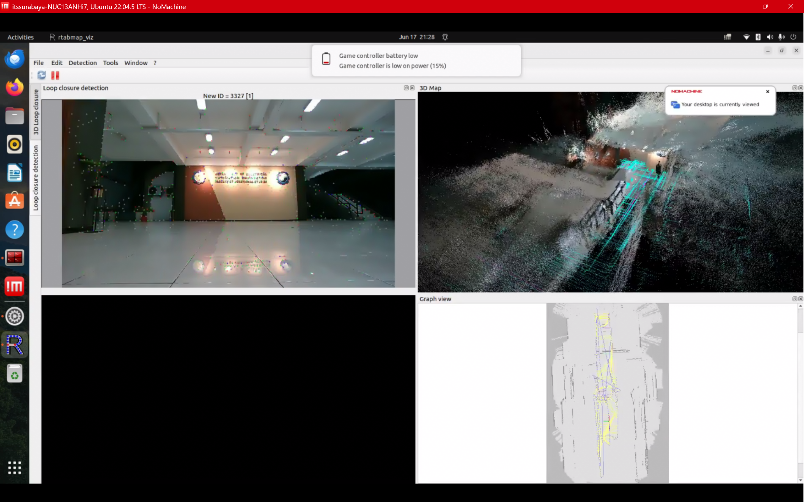
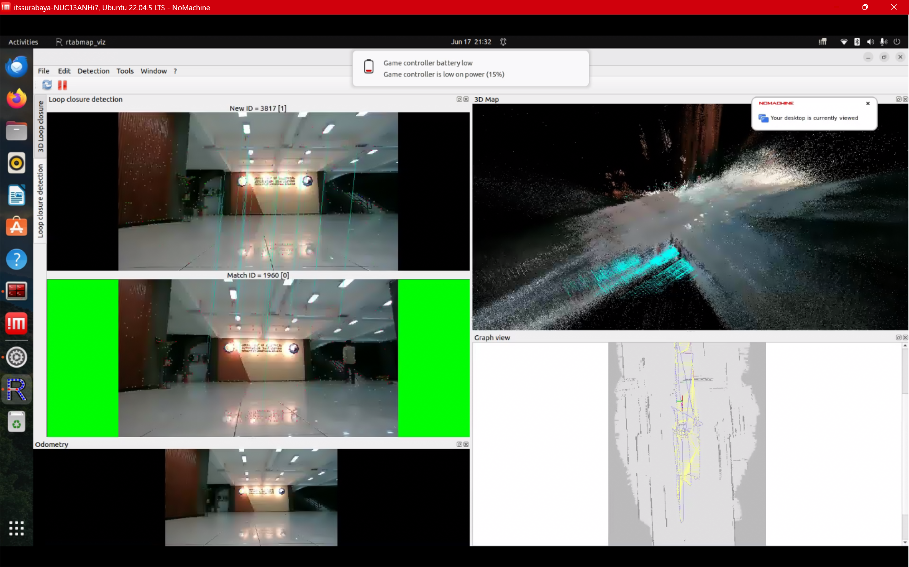
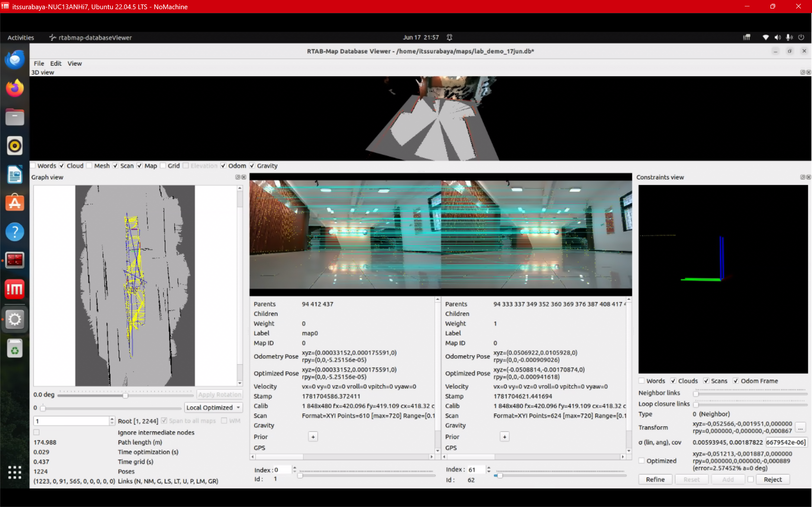

# HANDOVER — Lokalisasi RTAB-Map (Plan A) — 17 Juni 2026

**Dari:** Mararevi Subagyo (2040241036) · **Untuk:** Tim AMR
**Status:** ✅ **LOCALIZATION BERHASIL LOCK** — tembok "0 loop closure / relokalisasi gagal" 2 minggu **pecah**.

---

## 1. Ringkasan (TL;DR)

Robot **berhasil melokalisasi diri di peta** (Plan A — navigasi berbasis peta). Kuncinya **bukan ganti
algoritma**, tapi **(a) tempel tekstur di dinding** + **(b) mapping ulang di kondisi sekarang** lalu
**localize di sesi yang sama**. Peta lama (11 Juni) gagal direlokalisasi karena kondisi (lighting/tata
ruang) sudah berubah + dinding polos.

Bukti kunci: covariance `/localization_pose` turun dari **9999 → 0,00006** dan `loop_closure_id`
berkali-kali **> 0** (match visual frame-sekarang ↔ node-peta).

## 2. Yang Dilakukan (17 Juni)

1. Diagnosa peta lama (`mapping_20260611.db`): config benar (`Mem/IncrementalMemory=false`,
   `InitWMWithAllNodes=true`), VIO sehat (quality ~340), DB 1526 node — **tapi `loop_closure_id` tetap 0**
   bahkan di viewpoint persis → relokalisasi gagal (kondisi beda + tekstur kurang).
2. **Tempel tekstur** (poster/koran) di dinding sepanjang rute.
3. **Mapping ulang** di kondisi sekarang → `lab_demo_17jun.db`.
4. **Localize** terhadap peta baru di sesi yang sama → **LOCK**.

## 3. Hasil & Bukti

| Metrik | Sebelum (11 Juni) | Sesudah (17 Juni) |
|---|---|---|
| covariance posisi (elemen pertama) | 9999 (gagal) | **5,95e-05** (std ~7,7 mm) ✅ |
| `loop_closure_id` saat localize | 0 terus | **> 0 berkali-kali** (3817↔1960) ✅ |

Statistik `lab_demo_17jun.db`: **1224 poses · path 174,99 m · Links: Neighbor 1223, Global LC 91, LocalSpace 565**.


*Gambar 1. rtabmap_viz saat localization aktif — kamera live + fitur, 3D Map (point cloud + trajektori cyan), Graph view.*


*Gambar 2. Bukti relokalisasi: "New ID = 3817" cocok dengan node peta "Match ID = 1960" (background HIJAU = loop closure DITERIMA), garis cyan = pasangan fitur.*


*Gambar 3. rtabmap-databaseViewer `lab_demo_17jun.db` — Graph view, 3D view, Constraints view. 1224 poses, 91 global loop closure.*

## 4. File Peta

- Peta utama: `~/maps/lab_demo_17jun.db`
- Backup: `~/maps/backups/lab_demo_17jun_LOCKED.db`
- ⚠️ **Jangan ditimpa** — peta pertama yang terbukti bisa direlokalisasi.

## 5. Cara Reproduce (SOP singkat)

> Tiap terminal: `export ROS_DOMAIN_ID=42 && export RMW_IMPLEMENTATION=rmw_cyclonedds_cpp && source /opt/ros/humble/setup.bash && cd ~/amr_starter && source install/setup.bash`

```bash
# T1 — sensor
ros2 launch amr_bringup amr_full.launch.py use_slam:=false use_nav2:=false use_rtabmap:=false use_vr:=false use_failover:=false
# T2 — localization (VIO + load peta)
ros2 launch amr_3d_mapping rtabmap_localization.launch.py database_path:=$HOME/maps/lab_demo_17jun.db
# T3 — verifikasi lock
ros2 topic echo /info | grep loop_closure_id                       # harus > 0
ros2 topic echo /localization_pose --field pose.covariance --once   # elemen pertama << 1
```

## 6. Known Issues / Catatan

1. **Drift VIO** — trajektori "menjalar" karena path panjang (175 m / banyak lap) + IMU sempat error. Tidak
   menggagalkan localization (loop closure mengoreksi), tapi 3D cloud agak ghosting. Cloud lebih rapi: mapping 1 loop pendek.
2. **RealSense IMU** warning `"Motion Module failure / IMU Calibration not available"` saat startup. VIO tetap
   jalan (quality 340) tapi sumber drift; perlu cek kalibrasi/firmware IMU.
3. **Servo steering** sempat "gerak sendiri" + linkage longgar. Dugaan kuat: **joystick lowbat (15%)** bikin
   input drift — charge joystick dulu sebelum simpulkan servo rusak. Kencangkan sekrup horn.
4. **LiPo degraded** — jaga > 22 V biar servo tidak brownout.

## 7. Next Steps

1. Charge joystick + cek servo (sebelum tes driving).
2. **Nav2** (navigasi otonom ke goal): localization siap; tinggal costmap + planner
   (SmacHybrid DUBIN + RPP sudah ada di `amr_slam/config/nav2_params.yaml`). Butuh servo sehat.
3. (Opsional) Re-map 1 loop pendek untuk 3D cloud lebih bersih.

**Inti:** fondasi Plan A (localization) sudah JALAN & terbukti. Sisanya = Nav2 + benahi hardware kecil.
